# lean-deck

**One slide API, seventeen design languages.**

A slide deck is two things that keep getting tangled: *what you say* and *how it looks*.
lean-deck keeps them in separate files. Slides never name a colour, a shadow, or a font —
they read theme tokens. Change one string and the whole deck is wearing a different design language.

```tsx
<Statement t={theme} eyebrow="lean-deck"
  pre="One slide API," accent="seventeen design languages" post="." />
```

That slide renders as frosted glass, as pressed neumorphism, as a 1984 Macintosh window,
or as neubrutalism — depending only on which theme object you hand it.

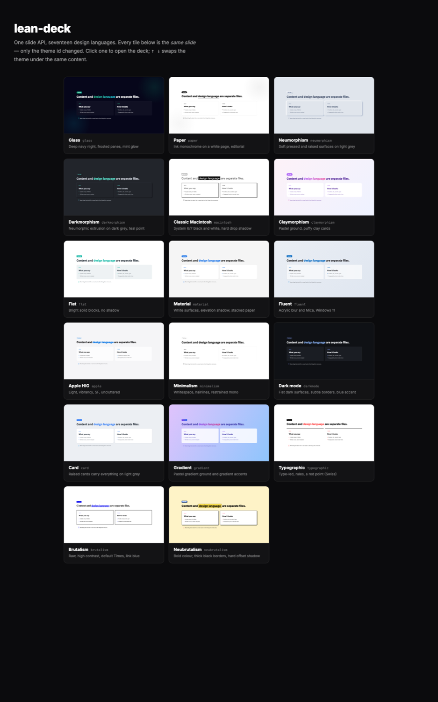

---

## The same slide, seventeen ways

Identical deck source. Only the theme id changed.

| | |
|---|---|
| **Glass** — deep navy, frosted panes, mint glow | **Paper** — warm off-white, printed page |
| 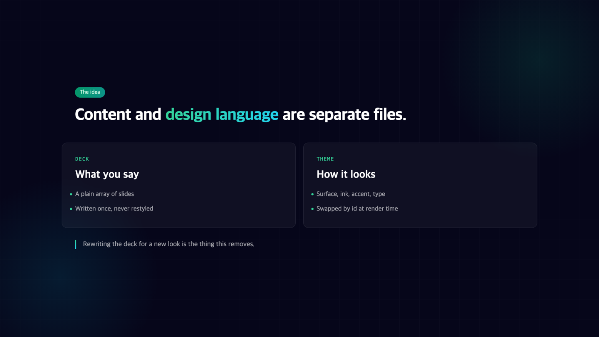 | 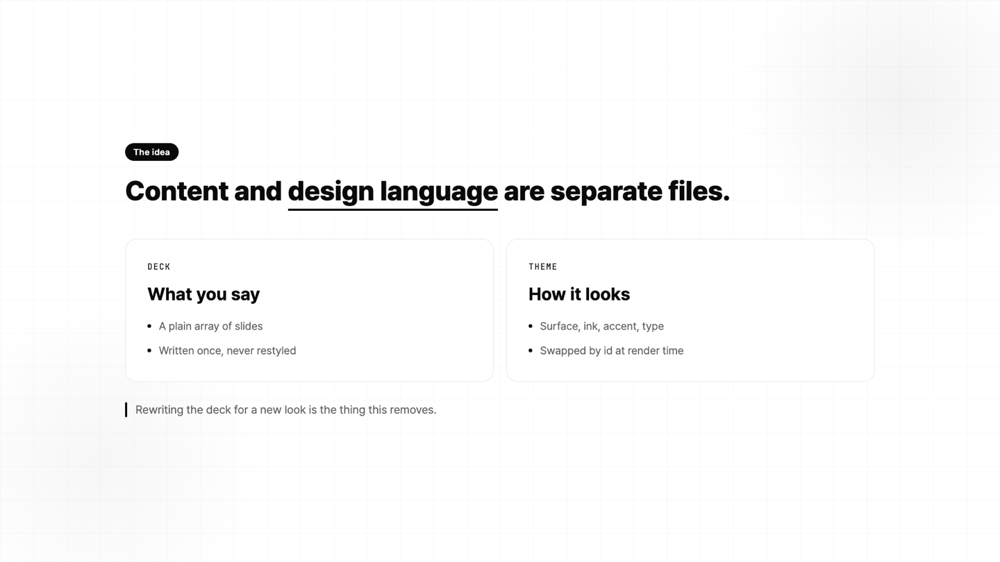 |
| **Neumorphism** — light grey, soft extrusion | **Darkmorphism** — dark grey extrusion, teal point |
| 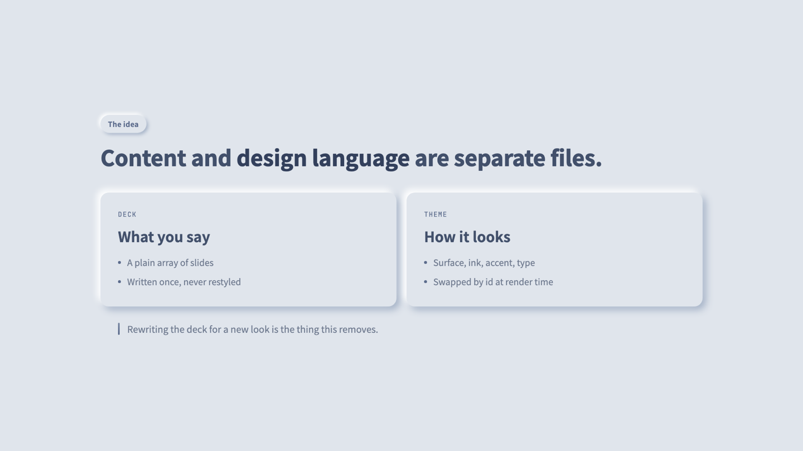 | 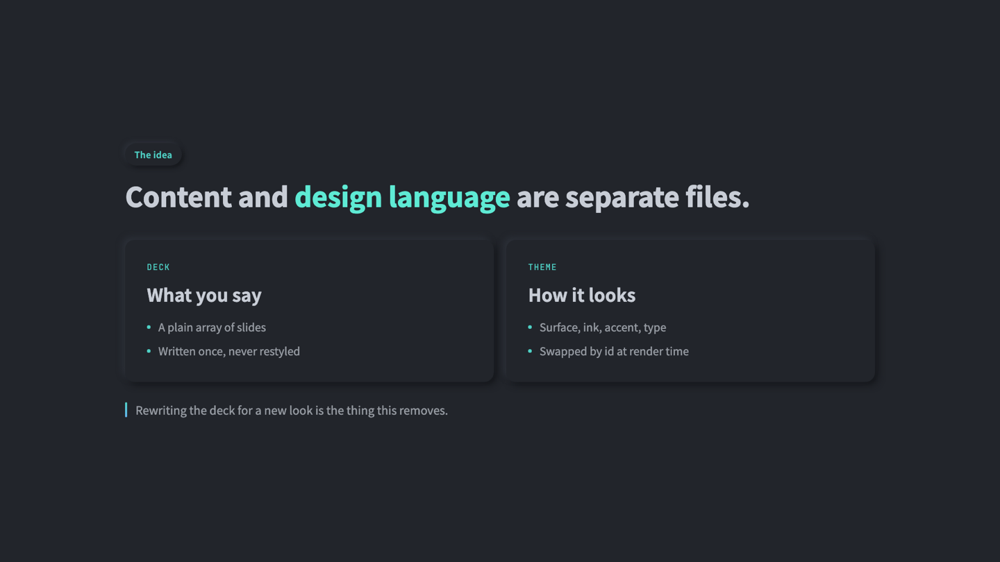 |
| **Macintosh** — System 6/7, hard drop shadow | **Claymorphism** — pastel, puffy clay |
| 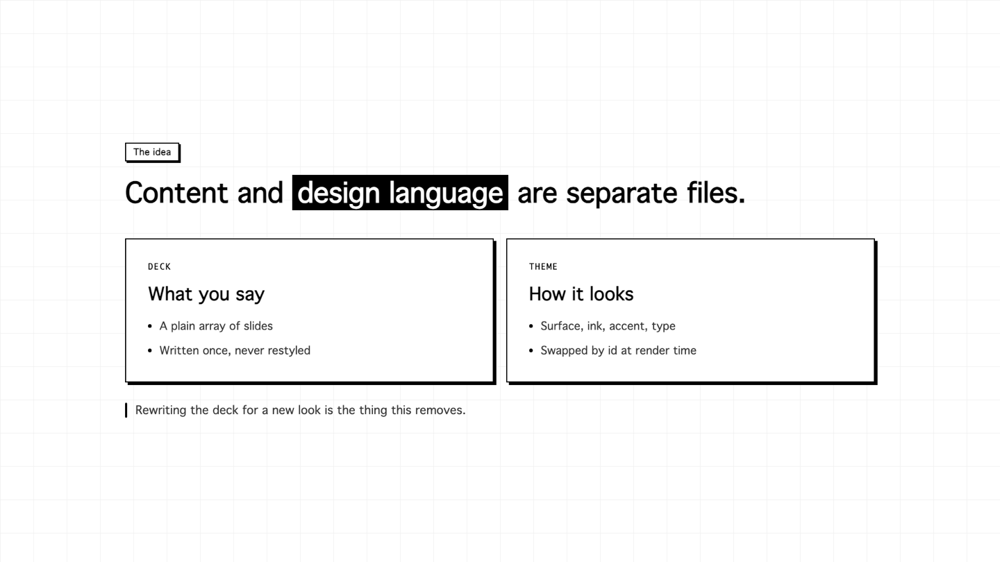 | 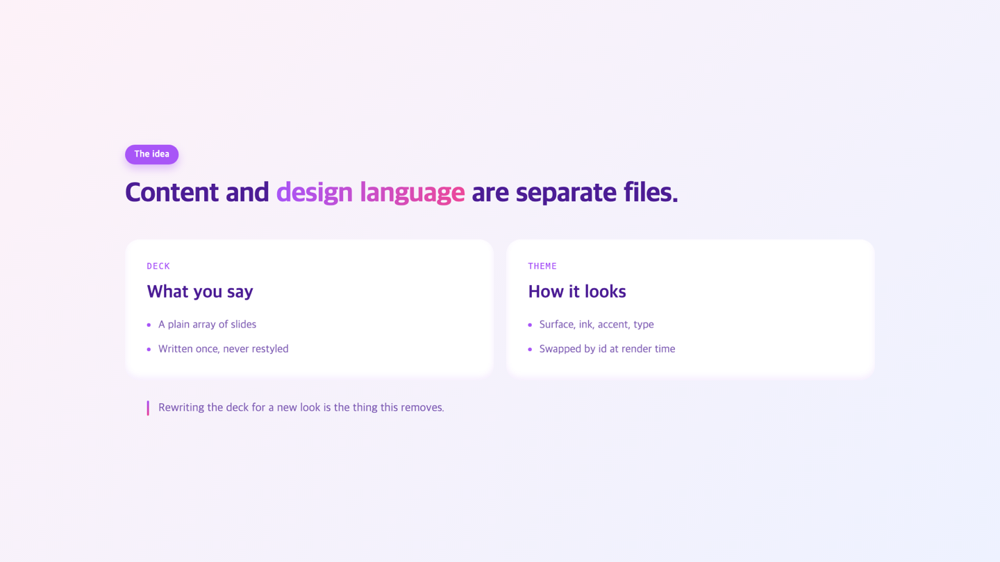 |
| **Flat** — no depth, colour blocks | **Material** — elevation and ripple language |
| 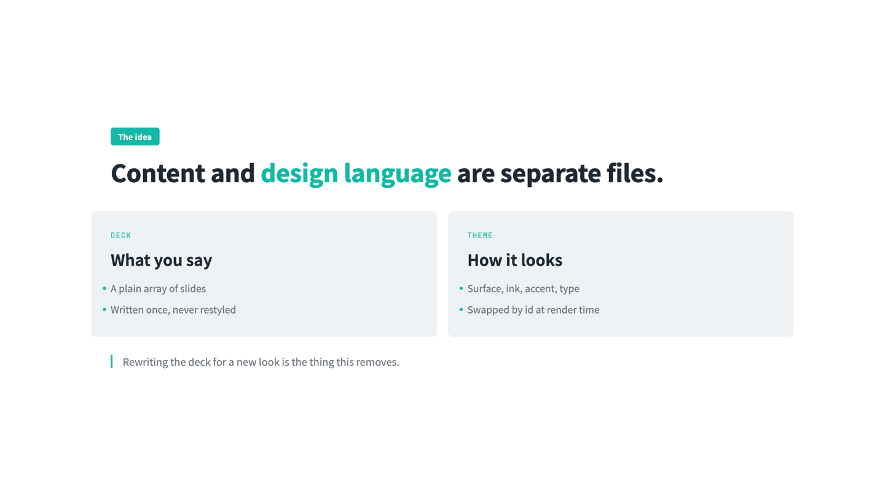 | 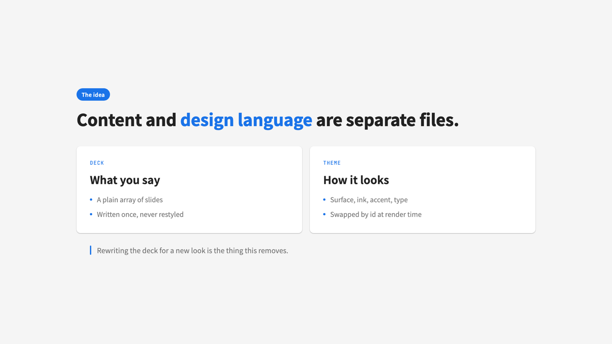 |
| **Fluent** — acrylic, Windows tone | **Apple** — system grey, quiet hierarchy |
| 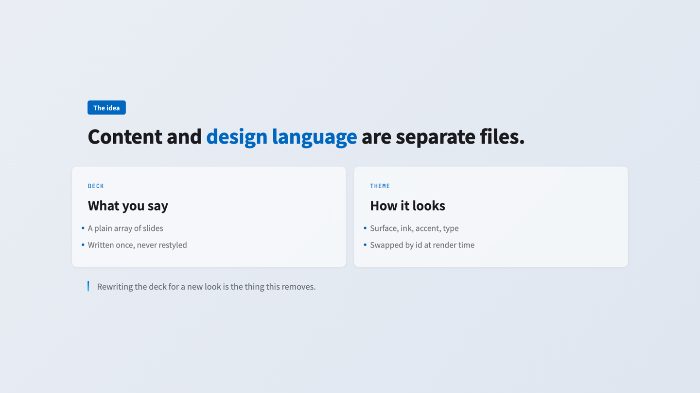 | 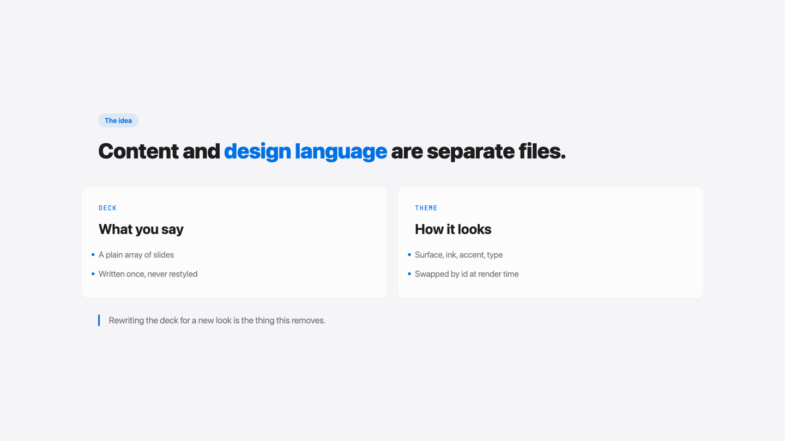 |
| **Minimalism** — hairlines and space | **Darkmode** — true dark, low glare |
| 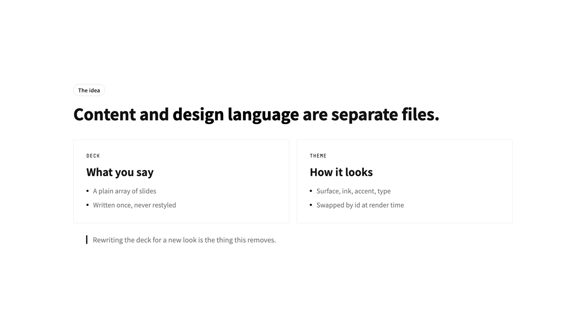 | 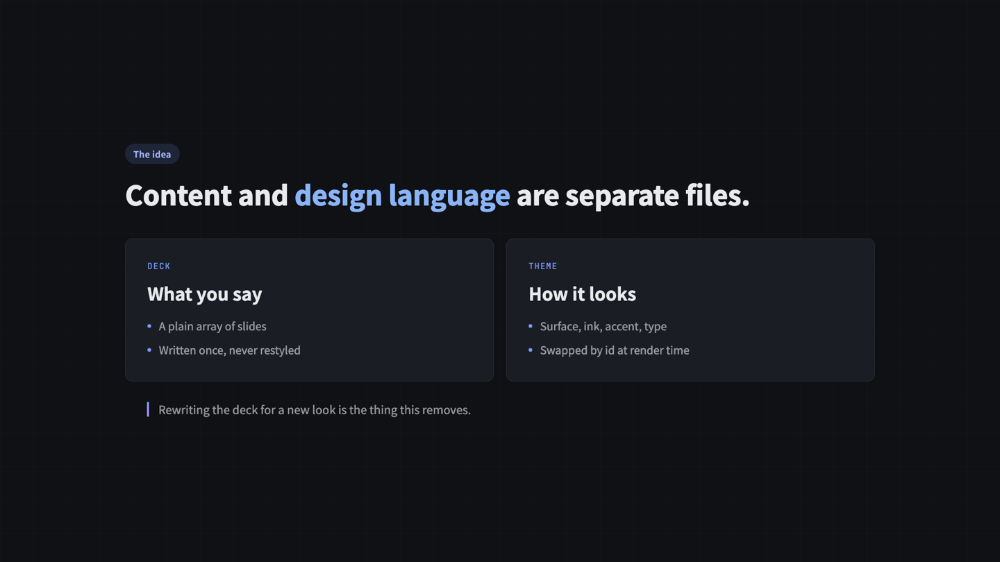 |
| **Card** — everything is a raised card | **Gradient** — colour that moves across the page |
| 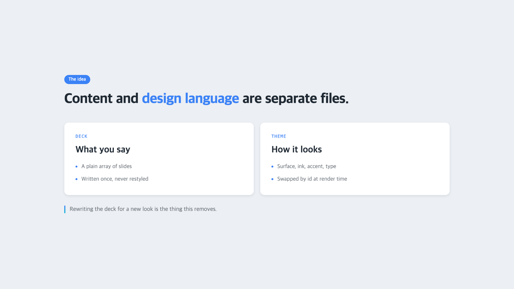 | 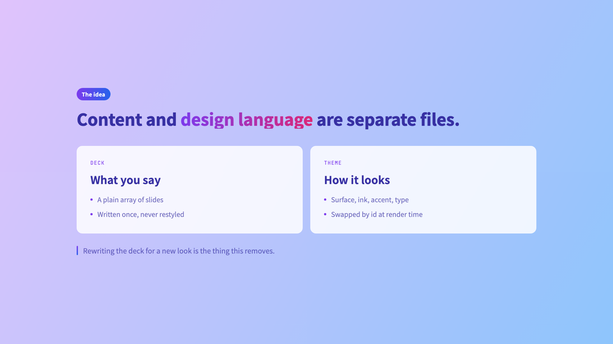 |
| **Typographic** — type does all the work | **Brutalism** — raw structure, visible seams |
| 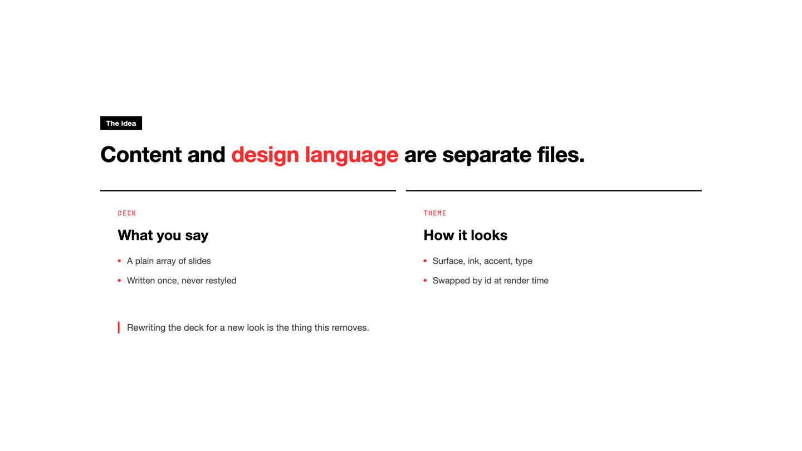 | 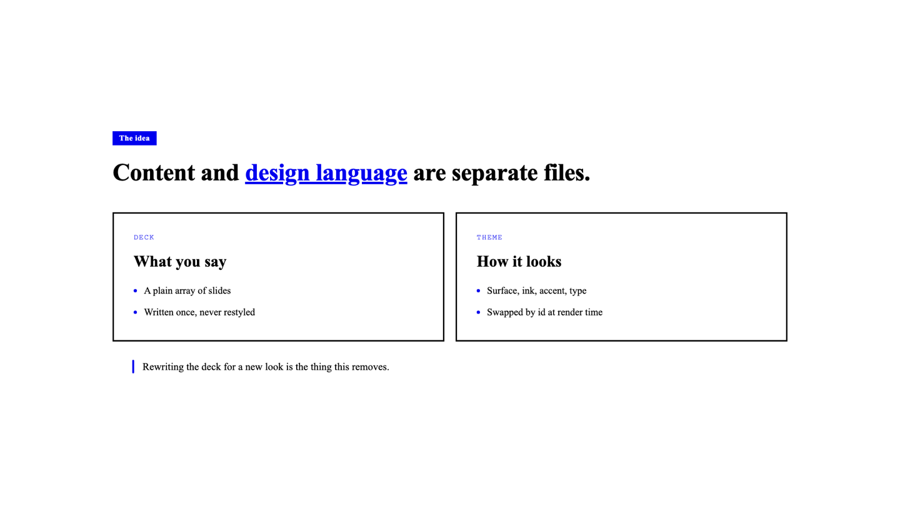 |
| **Neubrutalism** — thick borders, hard offset shadow | |
| 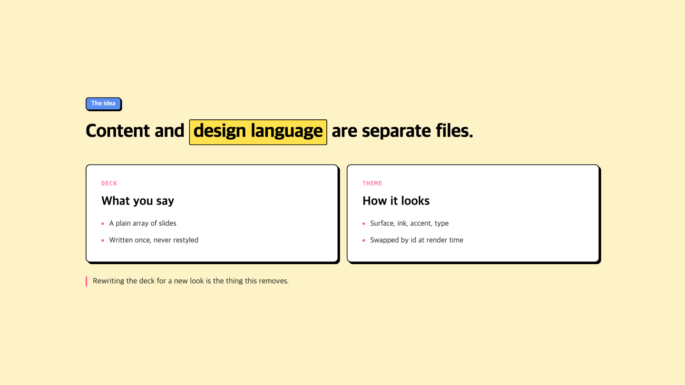 | |

---

## Run it

```bash
git clone https://github.com/beyondworks/lean-deck.git
cd lean-deck
npm install
npm run dev
```

Open <http://localhost:3000> for the theme gallery, or jump straight into the deck:

```
http://localhost:3000/deck?theme=glass
```

**Keys** — `←` `→` move between slides · `↑` `↓` swap the theme under the same content ·
`\` toggles fullscreen · `Home` / `End` jump to the ends.
Every modifier combination is passed through to the browser, so `Cmd+F` and `Cmd+P` still work.

Add `&raw=1` to any deck URL to render a bare 1920×1080 frame with no chrome — that is how
the screenshots above were taken, and how you export slides to PNG or feed them to a video pipeline.

---

## Writing a deck

A deck is an array. Each slide is a function of the theme.

```tsx
import { Base, Statement, Head, Tail, Cols } from '@/lean-deck/kit';
import type { Theme } from '@/lean-deck/themes';

export const slides = [
  {
    title: 'Cover',
    render: (t: Theme) => (
      <Statement t={t} eyebrow="Q3 review"
        pre="We shipped" accent="four things" post="that mattered."
        sub="And stopped two that did not."
        foot="Product · October" />
    ),
  },
  {
    title: 'What shipped',
    render: (t: Theme) => (
      <Base t={t}>
        <Head t={t} eyebrow="What shipped" pre="Three of the four are" accent="already in use" post="." />
        <Cols t={t} items={[
          { idx: 'ONE',   title: 'Search that finishes your sentence', rows: ['Median 40 ms', 'No new index'] },
          { idx: 'TWO',   title: 'Bulk import from a spreadsheet',     rows: ['Ten thousand rows a minute'] },
          { idx: 'THREE', title: 'Weekly digest',                      rows: ['Opt-in, 31 % open rate'] },
        ]} />
        <Tail t={t}>The fourth landed on Friday and has no numbers yet.</Tail>
      </Base>
    ),
  },
];
```

Render it with any theme:

```tsx
import { THEMES } from '@/lean-deck/themes';
slides[0].render(THEMES.brutalism);
```

---

## Components

`src/lean-deck/kit.tsx` — every one takes `t` (the theme) and nothing about styling.

| Component | For |
|---|---|
| `Statement` | A full-bleed sentence. Covers, turning points, closings. |
| `Base` | The slide frame — background, ambient wash, grid, content column. |
| `Head` | Eyebrow tag plus an action title with one accented phrase. |
| `Tail` | A closing caption on an accent bar. |
| `Cols` | N cards in a row: index label, title, bullet lines. |
| `Flow` | N numbered steps with optional code and description. |
| `Checklist` | A ticked grid of items. |
| `Compare` | Before/after rows — the "before" sits inset, the "after" raised. |
| `Banner` | A pulled quote or a single instruction. |
| `BigStat` | One enormous number. |
| `Card` | The primitive. Compose your own layouts with it. |
| `Tag` `Accent` `Warn` | Inline pieces. |

Helpers: `bleed(padding)` pulls a card group left by its own padding so the card *text* keeps
the alignment line; `RAIL` is the distance from the alignment line to the text of a quote or caption.

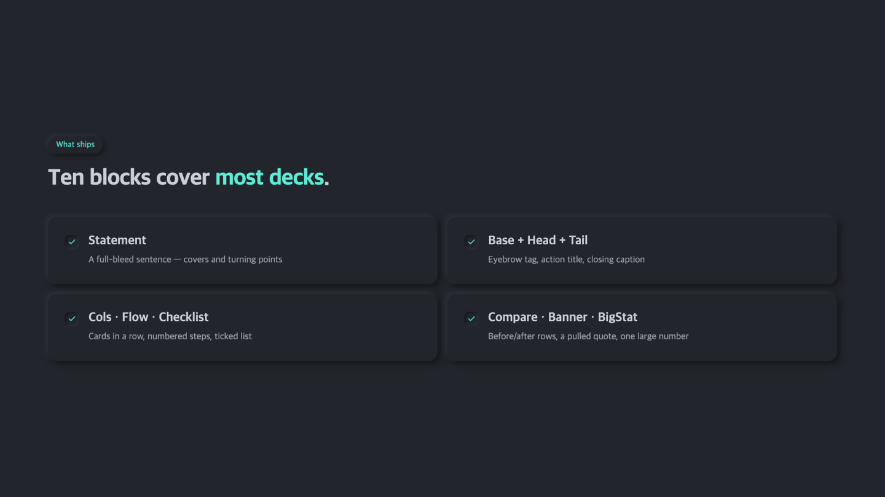

---

## Three rules the kit enforces

**One alignment line.** The eyebrow tag, the title, the text inside every card, and the accent
bar of quotes and captions all start at the same x. Cards bleed left by their own padding
so their content lands on the line rather than their corner.

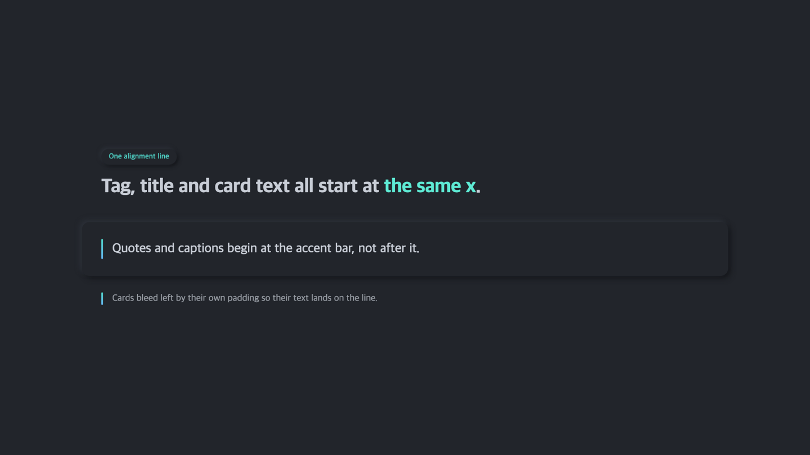

**Depth means something.** Raised is an object placed on the surface; inset is a container
holding something — a quote, a prior state, an icon well. Depth is never used for emphasis.

**Emphasis is not a border.** No highlight rings, no coloured edges on one card out of three.
Emphasis comes from wording, from the accent colour on a label, and from the accented phrase
in the title.

---

## Korean typography

The kit is built for decks that mix Korean and Latin.

- `word-break: keep-all` and `line-break: strict` are the default on every text surface,
  so Korean wraps at word boundaries instead of breaking mid-word.
- One type scale serves both scripts, which keeps the texture of a mixed line even.
- A zero-width word joiner (`U+2060`) between an accented phrase and the particle that follows
  keeps a one-syllable particle from being orphaned at the end of a line.

```tsx
const WJ = '⁠';
<Head t={t} eyebrow="예시" pre="셋 다 기능이 아니라" accent="상태" post={`${WJ}입니다.`} />
```

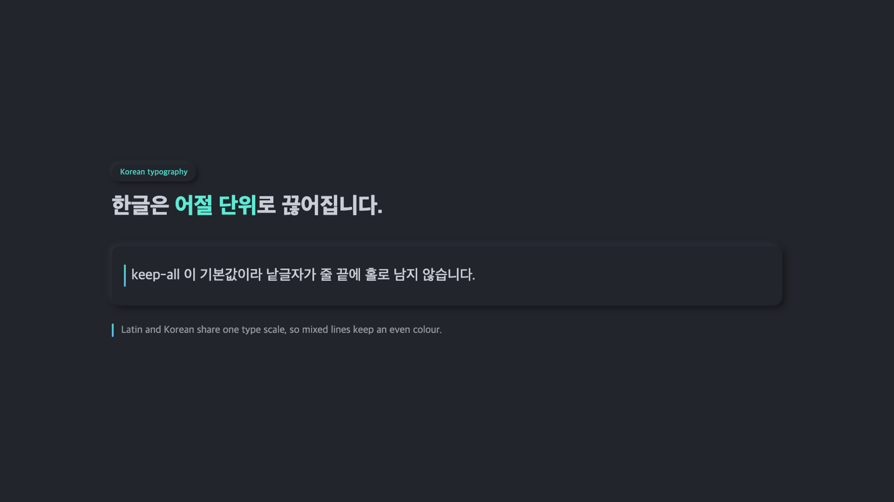

---

## Writing your own theme

A theme is a plain object. Copy the closest one in `src/lean-deck/themes.ts`, change the tokens,
add it to `THEMES` and `THEME_ORDER`. No component changes are needed — every slide picks it up.

```ts
mytheme: {
  id: 'mytheme', name: 'My theme', mood: 'one line describing the feel',
  font: "'Noto Sans KR', -apple-system, sans-serif",
  mono: "'JetBrains Mono', monospace",
  page:  { background: '#101014' },
  grid:  null,                       // or { color, opacity } for a faint rule grid
  orbs:  null,                       // or { tl, br } for corner ambient washes
  ink:   { strong: '#f2f2f5', soft: 'rgba(242,242,245,.68)', mute: 'rgba(242,242,245,.44)' },
  accent: '#7dd3fc', accent2: '#a78bfa',
  heading: { color: '#7dd3fc' },     // style for the accented phrase in a title
  card:    { background: '#16161b', borderRadius: 16 },        // raised — an object
  cardHi:  { background: '#0d0d11', borderRadius: 16 },        // inset  — a container
  tag:     { background: '#16161b', color: '#7dd3fc', borderRadius: 9999, padding: '9px 18px', fontWeight: 600 },
  iconBox: { background: '#0d0d11', borderRadius: 10 }, iconColor: '#7dd3fc',
  bar:     'linear-gradient(180deg,#7dd3fc,#a78bfa)',
  warn:    { bg: '#16161b', border: 'none', color: '#f08a8a' },
},
```

---

## What is in this repo

```
src/lean-deck/themes.ts    17 themes + the Theme type
src/lean-deck/kit.tsx      the slide components
src/lean-deck/DemoDeck.tsx the deck in the screenshots
src/app/page.tsx           theme gallery
src/app/deck/page.tsx      the viewer (keys, scaling, raw export)
```

Next.js is only the harness for the viewer. `themes.ts` and `kit.tsx` depend on React alone —
drop them into Vite, Remix, Astro, or a Remotion composition and they work unchanged.

## License

MIT — see [LICENSE](LICENSE).
